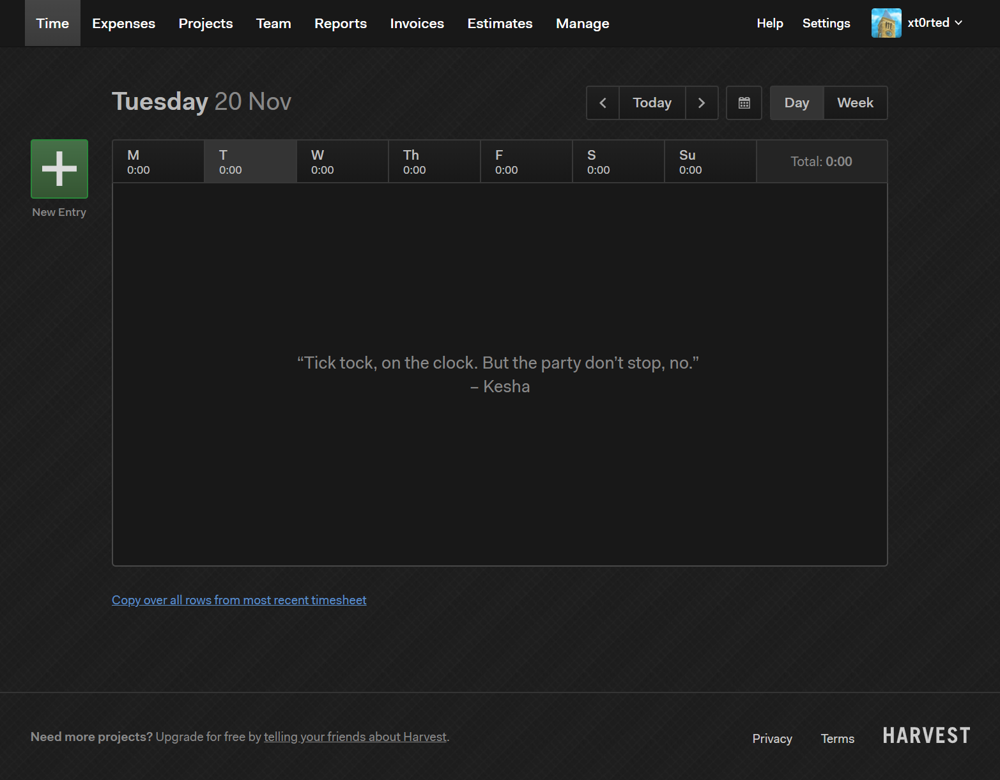

# Harvest-Dark

A dark theme for [Harvest](https://getharvest.com) based on the color scheme of [GitHub Dark](https://github.com/StylishThemes/GitHub-Dark).

## Preview

## Installation

- Install [Stylus](https://add0n.com/stylus.html) for either [Chrome](https://chrome.google.com/webstore/detail/stylus/clngdbkpkpeebahjckkjfobafhncgmne), [Firefox](https://addons.mozilla.org/en-US/firefox/addon/styl-us/), or [Opera](https://addons.opera.com/en-gb/extensions/details/stylus/).
- Install [the usercss](https://raw.githubusercontent.com/xt0rted/Harvest-Dark/master/Harvest-Dark.user.css) which supports automatic updates.
